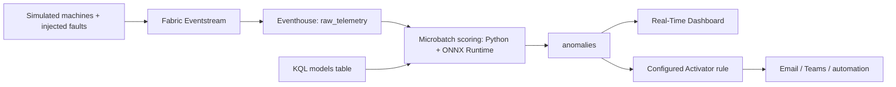

# Anomaly Detection on Microsoft Fabric

This project demonstrates an end-to-end anomaly detection flow: simulated machines produce data with injected example faults, Fabric receives the events, a custom ONNX model detects anomalies, and configured Activator rules trigger actions.

The central implementation is the model lifecycle: train it, export it to ONNX, load it into a Fabric KQL database, and execute it as new data arrives.

[Illustrated guide in Italian](https://faustinopalma.github.io/anomaly-detection-fabric-demo/)

## End-to-end flow



The simulator sends measurements to an Eventstream custom endpoint. Eventstream writes them to `raw_telemetry` in the Eventhouse's KQL database. Fault injection changes the generated signal, for example with a spike, a gradual drift, or a fixed value.

Scoring uses *microbatches*: incoming data is collected into small batches before the model runs. The ingestion policy sets a maximum batching time of one minute. This queued-ingestion path supports the Python plugin used by the scoring update policy. Detection latency includes batch collection, window formation, and model execution.

## Create the ONNX model

The detector is a Transformer autoencoder: a neural network trained to reconstruct normal sequences of measurements. Its reconstruction error becomes an anomaly score.

1. **Prepare windows.** Group normal data into sequences of 64 time steps, with one column per signal. Fit a scaler that stores each signal's mean and standard deviation so training and inference use the same normalization.
2. **Train and calibrate.** Train on normal windows, then use separate data with injected faults to compare variants and select a detection threshold. Training can run locally or on Azure Machine Learning.
3. **Export.** Export the network and score calculation together to ONNX. The saved CNC models average squared reconstruction errors over time for each signal, then take the largest average as the score. The exporter compares ONNX Runtime results with PyTorch results.

With the local dependencies installed, this command trains and exports one of the included models:

```powershell
python tools/cnc_ae_lab.py M-003 --epochs 18 --save
```

The [training laboratory](tools/cnc_ae_lab.py) writes its artifacts under `models/transformer_ae_small__M-003/`. Registration uses these three files:

| File | Contents |
| --- | --- |
| `model.fp16.onnx` | Network weights and score calculation, with reduced-precision weights to keep the file compact. |
| `scaler.json` | Signal order, means, and standard deviations. |
| `metadata.json` | Model name, window size, threshold, and training settings. |

The exporter checks that the Base64-encoded model fits the project's 1 MiB inline payload budget. The [training guide](docs/cnc_sota_training.md) gives the local and Azure ML commands.

## Load and run the model in Fabric

**The model is stored in the `models` table of the KQL database inside the Eventhouse.** The [registration script](tools/05_register_model.py) reads the three files, encodes the ONNX bytes as Base64, and inserts a new versioned row. The model bytes go into `payload`; scaler and threshold go into `metadata`. Window size and signal order have dedicated columns.

For example, after training an included model and preparing the Fabric tables:

```powershell
python tools/05_register_model.py models/transformer_ae_small__M-003
```

The script resolves the workspace and KQL database from the local environment configuration. Each registration increments the model version; `latest_model()` selects the newest version for a given name.

Execution is connected to ingestion through an *update policy*, a KQL rule that runs a transformation when a source table receives data:

1. A new batch enters `raw_telemetry`. The policy calls the scoring function associated with the model.
2. KQL forms complete windows, adding recent history where needed, and reads the model row.
3. The `python()` plugin decodes `payload`, loads it with ONNX Runtime, and normalizes the windows using the stored scaler.
4. ONNX Runtime returns a score per window. KQL applies the threshold and activity filter, then writes detections with their model version to `anomalies`.

The setup requires the Python plugin enabled for the target Eventhouse/KQL database and an image containing ONNX Runtime. The implementation is in [the model registry](kql/02_models.kql), [scoring functions](kql/03_scoring_functions.kql), and [update policies](kql/04_update_policy.kql).

## Trigger an action

A Fabric Activator rule evaluates a query over `anomalies` and triggers the selected action when its condition is met. An example rule groups detections by machine and sends a Teams message when the count crosses a threshold. Recipients, evaluation frequency, and actions are configured in the Fabric portal. The Real-Time Dashboard and [operator panel](webapp/README.md) show detections alongside the injected faults.

## Generate synthetic data from a reference sample

The project also explores how to generate new sequences that reproduce the statistical behaviour of an existing dataset. Start with a sample containing repeated operating cycles, align its signals, and measure their distributions, relationships, timing, and changes between operating phases.

The [profile builder](tools/cnc_build_profile.py) extracts per-phase means, variability, ranges, cycle durations, pauses, and autocorrelation: the relationship between consecutive values. The [profile-driven generator](simulator-local/cnc_engine.py) samples new cycles from those parameters, with temporal continuity between measurements.

The [synthgen pipeline](synthgen/pipeline.py) adds a learned approach: a transition model generates operating phases, a conditional diffusion model generates signal windows for each phase, and a timing model assigns timestamps. Diffusion learns to turn noise into sequences resembling the reference data. Generated and reference data are compared through distributions, correlations, and temporal statistics; the measured differences guide adjustments to the generator. The resulting traces supply training data and simulator input.

## Run the demo

Follow the [runbook](docs/RUNBOOK.md) for dependencies, credentials, and setup. The sequence is: prepare a Fabric workspace and capacity, connect Eventstream to the KQL database, enable Python, apply the KQL scripts, register the models, start the simulator, and configure the Activator rule. Fabric capacity and optional cloud simulation/training incur usage costs.

| Task | Entry point |
| --- | --- |
| Train and export | [tools/cnc_ae_lab.py](tools/cnc_ae_lab.py), [cloud-training/submit_cnc_sota.py](cloud-training/submit_cnc_sota.py) |
| Register the model | [tools/05_register_model.py](tools/05_register_model.py) |
| Configure ingestion and scoring | [kql](kql), [tools/02_setup_kql_tables.py](tools/02_setup_kql_tables.py) |
| Generate synthetic data | [tools/cnc_build_profile.py](tools/cnc_build_profile.py), [synthgen](synthgen) |
| Run the simulator | [simulator-cloud/README.md](simulator-cloud/README.md) |

The [site source](site/index.html) is a self-contained HTML page. The [Pages workflow](.github/workflows/pages.yml) publishes only `site/` when that directory changes on `main`.
